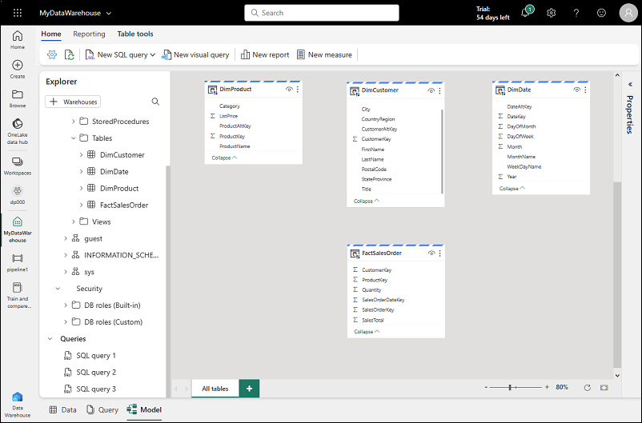
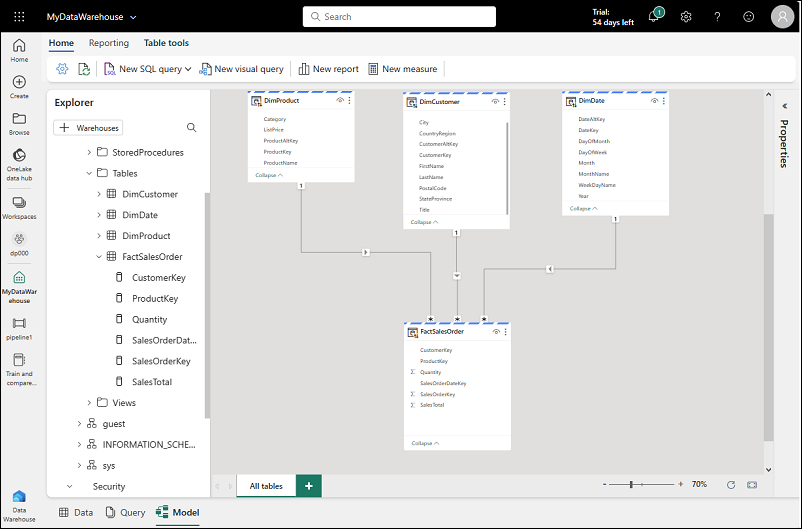
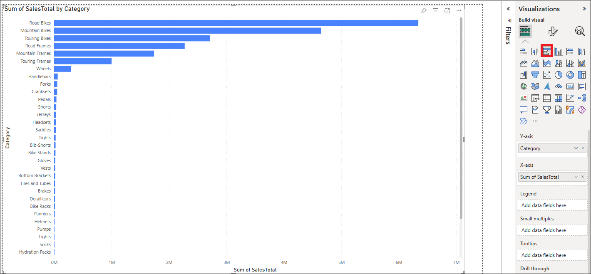

# Lab 07: Analyze data in a data warehouse

## Lab Overview

In this lab, you will dive into the world of data analysis within a data warehouse using Power BI. The lab is structured into tasks that will guide you through the process of creating a data warehouse, defining a data model, querying tables, and visualizing your data. Each task contributes to building a strong foundation for efficient data analysis.

## Lab Objectives

Task 1 :  Create a data warehouse<br>
Task 2 : Create tables and insert data<br>
Task 3 : Define a data model<br>
Task 4 : Query data warehouse tables<br>
Task 5 : Create a view and Visualize your data<br>


### Estimated timing: 30 minutes

## Architecture Diagram 


## Task 1:  Create a data warehouse

Now that you already have a workspace, it's time to switch to the *Data Warehouse* experience in the portal and create a data warehouse.

1. At the bottom left of the Power BI portal, switch to the **Data Warehouse** experience.

    The Data Warehouse home page includes a shortcut to create a new warehouse:

    

2. In the **Data Warehouse** home page, create a new **Warehouse**.
   
   - **Name:** Enter **Data Warehouse-<inject key="DeploymentID" enableCopy="false"/>** .

     After a minute or so, a new warehouse will be created

## Task 2 : Create tables and insert data

A warehouse is a relational database in which you can define tables and other objects.

1. In your new warehouse, select the **Create tables with T-SQL** tile.

   

2. Replace the default SQL code with the following CREATE TABLE statement:

    ```sql
   CREATE TABLE dbo.DimProduct
   (
       ProductKey INTEGER NOT NULL,
       ProductAltKey VARCHAR(25) NULL,
       ProductName VARCHAR(50) NOT NULL,
       Category VARCHAR(50) NULL,
       ListPrice DECIMAL(5,2) NULL
   );
   GO
    ```

    

3. Use the **&#9655; Run** button to run the SQL script, which creates a new table named **DimProduct** in the **dbo** schema of the data warehouse.

4. Use the **Refresh** button on the toolbar to refresh the view. Then, in the **Explorer** pane, expand **Schemas** > **dbo** > **Tables** and verify that the **DimProduct** table has been created.

5. On the **Home** menu tab, use the **New SQL Query** button to create a new query, and enter the following INSERT statement:

    ```sql
   INSERT INTO dbo.DimProduct
   VALUES
   (1, 'RING1', 'Bicycle bell', 'Accessories', 5.99),
   (2, 'BRITE1', 'Front light', 'Accessories', 15.49),
   (3, 'BRITE2', 'Rear light', 'Accessories', 15.49);
   GO
    ```

6. Run the new query to insert three rows into the **DimProduct** table.

7. When the query has finished, select the **Data** tab at the bottom of the page in the data warehouse. In the **Explorer** pane, select the **DimProduct** table and verify that the three rows have been added to the table.

8. On the Home menu tab, use the New SQL Query button to create a new query for each table. Open the first text file, from C:\LabFiles\Files\create-dw-01.txt, and copy the 
   Transact-SQL code related to the 'DimProduct' table. Paste the 'DimProduct' table code into the query pane you created and execute the query. Repeat the steps for the 
  'DimCustomer', 'DimDate' and 'FactSalesOrder' tables using the respective files, C:\LabFiles\Files\create-dw-02.txt and C:\LabFiles\Files\create-dw-03.txt. Please ensure that 
   each query is executed in its own query pane for each respective table. **Note:** remove the GO command in this query as well .


   

9. Run the query, which creates a simple data warehouse schema and loads some data. The script should take around 30 seconds to run.

10. Use the **Refresh** button on the toolbar to refresh the view. Then in the **Explorer** pane, verify that the **dbo** schema in the data warehouse now contains the following four tables:
    - **DimCustomer**
    - **DimDate**
    - **DimProduct**
    - **FactSalesOrder**

      

    > **Tip**: If the schema takes a while to load, just refresh the browser page.

## Task 3 : Define a data model

A relational data warehouse typically consists of *fact* and *dimension* tables. The fact tables contain numeric measures you can aggregate to analyze business performance (for example, sales revenue), and the dimension tables contain attributes of the entities by which you can aggregate the data (for example, product, customer, or time). In a Microsoft Fabric data warehouse, you can use these keys to define a data model that encapsulates the relationships between the tables.

1. At the bottom of the page in the data warehouse, select the **Model** tab.

2. In the model pane, rearrange the tables in your data warehouse so that the **FactSalesOrder** table is in the middle, like this:

    

3. Drag the **ProductKey** field from the **FactSalesOrder** table and drop it on the **ProductKey** field in the **DimProduct** table. Then confirm the following relationship details:
    - **Table 1**: FactSalesOrder
    - **Column**: ProductKey
    - **Table 2**: DimProduct
    - **Column**: ProductKey
    - **Cardinality**: Many to one (*:1)
    - **Cross filter direction**: Single
    - **Make this relationship active**: Selected
    - **Assume referential integrity**: Unselected

4. Repeat the process to create many-to-one relationships between the following tables:
    - **FactOrderSales.CustomerKey** &#8594; **DimCustomer.CustomerKey**

    

    - **FactOrderSales.SalesOrderDateKey** &#8594; **DimDate.DateKey**

5. When all of the relationships have been defined, the model should look like this:

    

## Task 4 : Query data warehouse tables

Since the data warehouse is a relational database, you can use SQL to query its tables.
Most queries in a relational data warehouse involve aggregating and grouping data (using aggregate functions and GROUP BY clauses) across related tables (using JOIN clauses).

1. Create a new SQL Query, and run the following code:

    ```sql
   SELECT  d.[Year] AS CalendarYear,
            d.[Month] AS MonthOfYear,
            d.MonthName AS MonthName,
           SUM(so.SalesTotal) AS SalesRevenue
   FROM FactSalesOrder AS so
   JOIN DimDate AS d ON so.SalesOrderDateKey = d.DateKey
   GROUP BY d.[Year], d.[Month], d.MonthName
   ORDER BY CalendarYear, MonthOfYear;
    ```

    >**Note**: that the attributes in the time dimension enable you to aggregate the measures in the fact table at multiple hierarchical levels - in this case, year and month. This is a common pattern in data warehouses.


2. Modify the query as follows to add a second dimension to the aggregation.

    ```sql
   SELECT  d.[Year] AS CalendarYear,
           d.[Month] AS MonthOfYear,
           d.MonthName AS MonthName,
           c.CountryRegion AS SalesRegion,
          SUM(so.SalesTotal) AS SalesRevenue
   FROM FactSalesOrder AS so
   JOIN DimDate AS d ON so.SalesOrderDateKey = d.DateKey
   JOIN DimCustomer AS c ON so.CustomerKey = c.CustomerKey
   GROUP BY d.[Year], d.[Month], d.MonthName, c.CountryRegion
   ORDER BY CalendarYear, MonthOfYear, SalesRegion;
    ```

    

3. Run the modified query and review the results, which now include sales revenue aggregated by year, month, and sales region.

## Task 5 : Create a view and Visualize your data

A data warehouse in Microsoft Fabric has many of the same capabilities you may be used to in relational databases. For example, you can create database objects like *views* and *stored procedures* to encapsulate SQL logic.
You can easily visualize the data in either a single query, or in your data warehouse. Before you visualize, hide columns and/or tables that aren't friendly to report designers.

1. Modify the query you created previously as follows to create a view (note that you need to remove the ORDER BY clause to create a view).

    ```sql
   CREATE VIEW vSalesByRegion
   AS
   SELECT  d.[Year] AS CalendarYear,
           d.[Month] AS MonthOfYear,
           d.MonthName AS MonthName,
           c.CountryRegion AS SalesRegion,
          SUM(so.SalesTotal) AS SalesRevenue
   FROM FactSalesOrder AS so
   JOIN DimDate AS d ON so.SalesOrderDateKey = d.DateKey
   JOIN DimCustomer AS c ON so.CustomerKey = c.CustomerKey
   GROUP BY d.[Year], d.[Month], d.MonthName, c.CountryRegion;
    ```

2. Run the query to create the view. Then refresh the data warehouse schema and verify that the new view is listed in the **Explorer** pane.

3. Create a new SQL query and run the following SELECT statement:

    ```SQL
   SELECT CalendarYear, MonthName, SalesRegion, SalesRevenue
   FROM vSalesByRegion
   ORDER BY CalendarYear, MonthOfYear, SalesRegion;
    ```
4. In the **Explorer** pane, select the **Model** view. 

5. Hide the following columns in your Fact and Dimension tables that are not necessary to create a report. Note that this does not remove the columns from the model, it simply hides them from view on the report canvas.
   
   1. FactSalesOrder
      - **SalesOrderDateKey**
      - **CustomerKey**
      - **ProductKey**

    

   2. DimCustomer
      - **CustomerKey**
      - **CustomerAltKey**
   3. DimDate
      - **DateKey**
      - **DateAltKey**
   4. DimProduct
      - **ProductKey**
      - **ProductAltKey** 

6. Now you're ready to build a report and make this dataset available to others. On the Home menu, select **New report**. This will open a new window, where you can create a Power BI report.

   

7. In the **Data** pane, expand **FactSalesOrder**. Note that the columns you hid are no longer visible. 

8. Select **SalesTotal**. This will add the column to the **Report canvas**. Because the column is a numeric value, the default visual is a **column chart**.

9. Ensure that the column chart on the canvas is active (with a gray border and handles), and then select **Category** from the **DimProduct** table to add a category to your column chart.

10. In the **Visualizations** pane, change the chart type from a column chart to a **clustered bar chart**. Then resize the chart as necessary to ensure that the categories are readable.

    

11. In the **Visualizations** pane, select the **Format your visual** tab and in the **General** sub-tab, in the **Title** section, change the **Text** to **Total Sales by Category**.

    

12. In the **File** menu, select **Save**. Then save the report as **Sales Report** in the workspace you created previously.

13. In the menu hub on the left, navigate back to the workspace. Notice that you now have three items saved in your workspace: your data warehouse, its default dataset, and the report you created.

    

    - Refer to [DataWarehouse](https://learn.microsoft.com/en-us/fabric/data-warehouse/data-warehousing) for more delated information

## Review

In this exercise, the completion of these tasks involved the establishment of a data warehouse that served as a centralized repository for structured data. Tables were created, and data was inserted into the warehouse , forming the basis for subsequent analysis. A data model was defined  to represent relationships between entities. Data warehouse tables were queried, extracting specific insights. Finally, a view was created, and data was visualized in PowerBi, providing a customized perspective and enhancing interpretability. The specific implementations and details were tailored to the characteristics of the dataset and the analytical requirements.

## Proceed to next exercise
